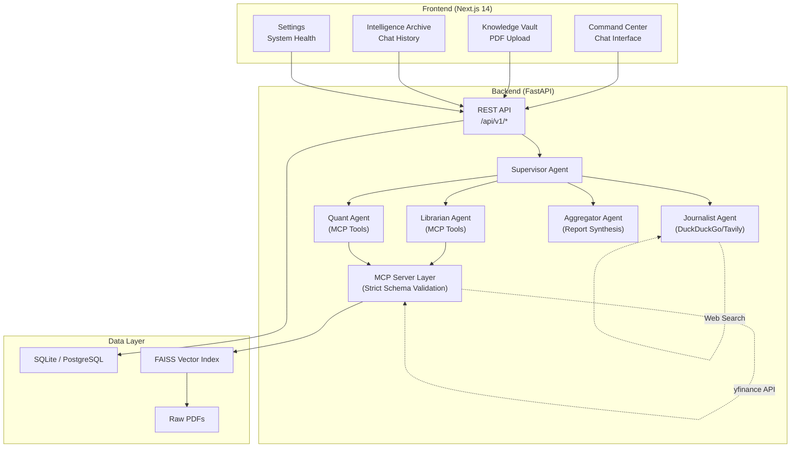

# AI Financial Research Team — Complete Project Walkthrough

> An end-to-end explanation of everything built across three development phases.

---

## What We Built

An **AI-powered financial analysis platform** where a team of 5 specialized AI agents collaborate to produce comprehensive investment reports. A user asks a question like *"Analyze NVDA stock"*, and the system orchestrates a Librarian (searches SEC filings), a Quant (computes technical indicators), a Journalist (scans live news), and an Aggregator (synthesizes everything into a final Buy/Sell/Hold report).



---

## Phase 1: Backend Implementation

### 1.1 Project Foundation

#### [config.py](file:///c:/Users/hites/AI-Financial-Research-Team/backend/app/core/config.py) — Global Configuration

Uses **Pydantic Settings** to manage all configuration through environment variables with sensible defaults:

| Setting | Default | Purpose |
|---------|---------|---------|
| `DATABASE_URL` | `sqlite:///./financial_analyst.db` | SQLite for dev, Postgres for Docker |
| `GEMINI_API_KEY` | `""` | Google Gemini LLM (required) |
| `TAVILY_API_KEY` | `None` | Premium search (optional) |
| `GEMINI_MODEL` | `gemini-1.5-flash` | Which Gemini model to use |
| `FAISS_INDEX_DIR` | `data/faiss_index/` | Where vector embeddings are stored |
| `RAW_PDF_DIR` | `data/raw_pdfs/` | Where uploaded PDFs are saved |

#### [logging.py](file:///c:/Users/hites/AI-Financial-Research-Team/backend/app/core/logging.py) — Centralized Logging

A simple, clean logging factory that gives every module a consistent format:
```
14:32:05 | INFO    | app.services.finance_api | Fetching stock data for AAPL
```

#### [session.py](file:///c:/Users/hites/AI-Financial-Research-Team/backend/app/db/session.py) — Database Session

Uses **SQLModel** (SQLAlchemy + Pydantic hybrid) with smart detection of SQLite vs Postgres:
- SQLite needs `check_same_thread=False` for FastAPI's async behavior
- Postgres doesn't support that flag
- The code auto-detects which DB and applies the correct args

#### [models.py](file:///c:/Users/hites/AI-Financial-Research-Team/backend/app/db/models.py) — Database Models

Two tables:
- **`ChatHistory`** — stores every user query and AI response with timestamps, indexed by `user_id`
- **`AnalysisReport`** — stores structured reports with ticker, verdict (Buy/Sell/Hold), and report content

---

### 1.2 The Three Services

These are the "tools" that the AI agents use to gather information.

#### [finance_api.py](file:///c:/Users/hites/AI-Financial-Research-Team/backend/app/services/finance_api.py) — Live Market Data

The `FinanceAPIService` class wraps the **yfinance** library to provide three capabilities:

1. **`get_stock_data(ticker, period)`** — Fetches OHLCV (Open, High, Low, Close, Volume) price history. Returns current price, % change, 52-week high/low, average volume.

2. **`get_company_info(ticker)`** — Fetches fundamentals: market cap, P/E ratio, sector, industry, dividend yield, EPS, revenue, profit margin, debt-to-equity, business summary.

3. **`calculate_technical_indicators(ticker, period)`** — Uses the **ta** (Technical Analysis) library to compute:
   - **RSI (14-day)** — Relative Strength Index. >70 = overbought (bearish), <30 = oversold (bullish)
   - **SMA (20 & 50-day)** — Simple Moving Averages for trend detection
   - **EMA (20-day)** — Exponential Moving Average (weights recent prices more)
   - **MACD** — Moving Average Convergence Divergence with signal line and histogram
   - Each indicator includes a human-readable interpretation (e.g., "Bullish (price > SMA50)")

#### [rag_service.py](file:///c:/Users/hites/AI-Financial-Research-Team/backend/app/services/rag_service.py) — RAG Pipeline (Retrieval-Augmented Generation)

This is the document intelligence engine. The full pipeline:

```
PDF Upload → Text Extraction (PyPDF2) → Chunking (1000 chars, 200 overlap)
    → Embedding (Gemini embedding-001) → FAISS Vector Index → Semantic Search
```

Key methods:
- **`ingest_pdf(file_path)`** — Extracts text from a PDF, splits it into overlapping chunks (1000 chars with 200-char overlap ensures no context is lost at boundaries), embeds each chunk using Google's `embedding-001` model, and adds them to a FAISS index. The index and chunks are serialized to disk with `pickle` + `faiss.write_index`.

- **`query(question, top_k=5)`** — Embeds the question using `retrieval_query` task type (optimized for search queries vs documents), searches the FAISS index for the closest vectors, and returns the top-k chunks with their similarity scores and source filenames.

- The chunking uses **overlapping windows** — each chunk overlaps the previous by 200 characters. This ensures that if important information spans a chunk boundary, it appears in at least one chunk intact.

#### [search_tool.py](file:///c:/Users/hites/AI-Financial-Research-Team/backend/app/services/search_tool.py) — Web News Search

A dual-provider search service with automatic fallback:
1. **Tavily** (if API key is configured) — Higher quality, structured results
2. **DuckDuckGo** (free fallback) — Uses the `DDGS` library for news search, no API key needed

Returns structured results: title, URL, snippet (capped at 300 chars), source, and date.

---

### 1.3 The Five AI Agents

All agents use the **Agno framework** with **Google Gemini** as the underlying LLM.

#### [supervisor.py](file:///c:/Users/hites/AI-Financial-Research-Team/backend/app/agents/supervisor.py) — The Orchestrator

The Supervisor is the **Lead Financial Strategist**. It's the only agent the API calls directly. It:
1. Receives the user's question
2. Delegates sub-tasks to the three specialist agents
3. Passes their findings to the Aggregator
4. Returns the Aggregator's final report

It has all four other agents registered as **tools**, so the Gemini model decides which specialists to invoke based on the question.

#### [librarian.py](file:///c:/Users/hites/AI-Financial-Research-Team/backend/app/agents/librarian.py) — Fundamental Analyst

The Librarian searches internal documents (10-K, 10-Q SEC filings) using the RAG pipeline. It wraps `rag_service.query()` as a tool called `search_documents`. Focus areas: Revenue, Profit Margins, Debt, Risks. If no documents are found, it states that clearly rather than hallucinating.

#### [quant.py](file:///c:/Users/hites/AI-Financial-Research-Team/backend/app/agents/quant.py) — Technical Analyst

The Quant has three tools: `get_stock_data`, `get_company_info`, and `calculate_technical_indicators`. It analyzes price action and indicators to give a **Bullish/Bearish/Neutral** verdict with key price levels.

#### [journalist.py](file:///c:/Users/hites/AI-Financial-Research-Team/backend/app/agents/journalist.py) — Sentiment Analyst

The Journalist uses `search_news` to find the latest articles about a company. It categorizes sentiment as **Positive/Negative/Neutral** and highlights major events (earnings, lawsuits, product launches).

#### [aggregator.py](file:///c:/Users/hites/AI-Financial-Research-Team/backend/app/agents/aggregator.py) — Report Synthesizer

The Aggregator is the **Lead Editor**. It receives reports from all three specialists and synthesizes them into a single Investment Report:
1. Executive Summary with Buy/Sell/Hold verdict
2. Dedicated sections for each analyst's findings
3. Resolves contradictions (e.g., strong fundamentals but weak technicals)

---

### 1.4 API Layer

#### [main.py](file:///c:/Users/hites/AI-Financial-Research-Team/backend/app/main.py) — FastAPI Application

The FastAPI app with:
- **Lifespan handler** (modern replacement for deprecated `@app.on_event`) — initializes the database on startup
- **CORS middleware** — restricted to `localhost:3000` + configurable `FRONTEND_URL` env var
- **`/health`** — Quick health probe for Docker/CI
- **`/api/v1/status`** — Detailed system status (uptime, agent list, RAG status, DB connectivity, API key presence, model name) consumed by the frontend Settings page

#### [endpoints.py](file:///c:/Users/hites/AI-Financial-Research-Team/backend/app/api/v1/endpoints.py) — API Routes

| Method | Endpoint | What It Does |
|--------|----------|-------------|
| `POST` | `/api/v1/analyze` | Takes `query` + `user_id`, runs the Supervisor Agent, saves result to DB, returns the report |
| `POST` | `/api/v1/ingest` | Accepts a PDF upload, saves to disk, runs RAG ingestion (extract → chunk → embed → FAISS) |
| `GET` | `/api/v1/history/{user_id}` | Returns all past analyses for a user, ordered by newest first |

#### [dependencies.py](file:///c:/Users/hites/AI-Financial-Research-Team/backend/app/api/dependencies.py) — Dependency Injection

FastAPI dependency that provides database sessions to endpoints using Python generators (`yield session`).

---

## Phase 2: Frontend Implementation

Built with **Next.js 14** (App Router), **Tailwind CSS**, **Shadcn/UI**, **React Query**, **Framer Motion**, and **Axios**.

### 2.1 Foundation Layer

#### [layout.tsx](file:///c:/Users/hites/AI-Financial-Research-Team/frontend/src/app/layout.tsx) — Root Layout

- Loads **Inter** font from Google Fonts
- Sets `dark` mode by default on `<html>`
- Wraps everything in `<Providers>` (React Query) → `<Toaster>` (notifications) → `<Sidebar>` + `<main>`
- SEO metadata: title, description, keywords

#### [providers.tsx](file:///c:/Users/hites/AI-Financial-Research-Team/frontend/src/lib/providers.tsx) — React Query Setup

Implements the **singleton pattern** for the QueryClient:
- Server-side: creates a fresh client per request (avoids data leakage between users)
- Client-side: reuses one client across the app (prevents re-fetching on navigation)
- Default config: 60s stale time, no refetch on window focus

#### [api.ts](file:///c:/Users/hites/AI-Financial-Research-Team/frontend/src/lib/api.ts) — API Client

Creates an Axios instance with `NEXT_PUBLIC_API_URL` (defaults to `localhost:8000`) and exports:
- Typed interfaces: `AnalyzeResponse`, `IngestResponse`, `ChatHistoryItem`, `SystemStatus`
- Functions: `analyzeStock()`, `ingestDocument()`, `getHistory()`, `getSystemStatus()`
- Uses proper URL encoding for query parameters

#### [hooks.ts](file:///c:/Users/hites/AI-Financial-Research-Team/frontend/src/lib/hooks.ts) — React Query Hooks

Custom hooks that connect the UI to the API:
- **`useAnalyze()`** — Mutation hook. On success, invalidates the `history` query cache so history updates automatically.
- **`useIngest()`** — Mutation hook for PDF uploads.
- **`useHistory(userId)`** — Query hook with 30s stale time. Only fires when `userId` is truthy.
- **`useSystemStatus()`** — Query hook with 10s refetch interval and 5s stale time for the live settings dashboard.

---

### 2.2 Pages

#### [page.tsx](file:///c:/Users/hites/AI-Financial-Research-Team/frontend/src/app/page.tsx) — Command Center (Dashboard)

The main chat interface. A 407-line React component with:

- **Empty state** — Shows the app logo, description, and 3 clickable suggestion prompts ("Analyze NVDA stock", "AAPL 10-K risks", "Tesla sentiment")
- **Chat messages** — User messages on the right (teal accent), assistant messages on the left with Markdown rendering
- **Markdown rendering** — Uses `react-markdown` with `react-syntax-highlighter` (One Dark theme) for code blocks. Inline code gets a teal `text-mint` style.
- **Loading state** — Animated skeleton loader with a 4-step agent pipeline visualization:
  1. Librarian searching 10-K filings...
  2. Quant computing RSI, MACD, SMA...
  3. Journalist scanning news sentiment...
  4. Aggregator synthesizing final report...
  
  Steps auto-advance every 3 seconds with a progress bar.
- **Actions** — Copy to clipboard, Export to PDF (using jsPDF)
- **Right panel** — "Live Intelligence" sidebar showing the agent pipeline status and analysis capabilities
- **Framer Motion** — `AnimatePresence` for smooth message enter/exit animations

#### Knowledge Vault (`/knowledge-vault`)

Drag-and-drop PDF upload page for 10-K/10-Q filings. Uses `react-dropzone`. Files are uploaded to `/api/v1/ingest` and processed through the RAG pipeline.

#### Intelligence Archive (`/history`)

Searchable list of all past analysis reports, sorted by date. Each entry shows the query and the AI response.

#### Settings (`/settings`)

Live system health dashboard with:
- **Auto-refreshing status** (every 10 seconds via `useSystemStatus` hook)
- Backend version, uptime, agent statuses
- RAG readiness (documents loaded, total chunks)
- Database connectivity check
- API key presence indicators (Gemini ✅, Tavily ✅/❌)
- Current model name

### 2.3 UI Components

11 **Shadcn/UI** primitives (`Button`, `Input`, `Badge`, `Tabs`, `Dialog`, `Progress`, `ScrollArea`, `Separator`, `Toast`, `Skeleton`, `DropdownMenu`) plus custom `Sidebar` and `Toaster` components. All styled with a custom dark theme (deep navy background, mint-green accents).

---

## Phase 3: Gap-Filling & Production Hardening

### 3.1 Package Structure

Added `__init__.py` files to all backend modules (`app/`, `agents/`, `api/`, `core/`, `db/`, `services/`, `tests/`) to ensure proper Python package resolution.

### 3.2 Backend Tests — 15 Tests Across 3 Files

#### [test_config.py](file:///c:/Users/hites/AI-Financial-Research-Team/backend/tests/test_config.py) — 9 Tests
- Settings load correctly, DATABASE_URL is set, FAISS/PDF dirs configured, default model name
- Database init creates both tables (`chathistory`, `analysisreport`)
- CRUD operations on `ChatHistory` and `AnalysisReport` models
- Logger factory returns valid loggers with handlers

#### [test_api.py](file:///c:/Users/hites/AI-Financial-Research-Team/backend/tests/test_api.py) — 6 Tests
- Health endpoint returns `200` with `status: "active"`
- Analyze endpoint with mocked supervisor (success + error + missing params)
- Ingest endpoint with fake PDF + missing file
- History endpoint empty + after-analysis

#### [test_services.py](file:///c:/Users/hites/AI-Financial-Research-Team/backend/tests/test_services.py) — Tests for All 3 Services
- FinanceAPI: valid ticker, invalid ticker, company info, technical indicators
- RAGService: init, text chunking (normal, small, empty), is_ready, empty query, mocked ingest+query
- SearchTool: DuckDuckGo search with mocked DDGS

#### [conftest.py](file:///c:/Users/hites/AI-Financial-Research-Team/backend/tests/conftest.py) — Shared Fixtures
- Overrides `DATABASE_URL` to in-memory SQLite for test isolation
- Sets a fake `GEMINI_API_KEY` so config loads
- Provides `engine`, `db_session` (per-test table cleanup), and `client` (FastAPI TestClient) fixtures

### 3.3 CI/CD Pipeline

#### [ci.yml](file:///c:/Users/hites/AI-Financial-Research-Team/.github/workflows/ci.yml) — 3-Job Pipeline

Triggers on push/PR to `main`:

1. **Backend job** — Python 3.11, pip cache, install deps + test deps, **ruff lint** (GitHub output format), **pytest**
2. **Frontend job** — Node 18, npm cache, `npm ci`, **ESLint** (`next lint`), **TypeScript** (`tsc --noEmit`), **Build** (`npm run build`)
3. **Docker job** — Only runs after both backend/frontend pass. Builds all 3 Docker services via `docker compose build`

### 3.4 Docker Setup

#### Backend [Dockerfile](file:///c:/Users/hites/AI-Financial-Research-Team/backend/Dockerfile)
- `python:3.11-slim` base, installs `libpq-dev` for Postgres
- Creates non-root `appuser` (UID 1001) for security
- Sets up data directory with proper permissions

#### Frontend [Dockerfile](file:///c:/Users/hites/AI-Financial-Research-Team/frontend/Dockerfile)
- **3-stage multi-stage build** for minimal image size:
  1. `deps` — installs `node_modules`
  2. `builder` — builds Next.js with standalone output
  3. `runner` — copies only the standalone build (no `node_modules` or source code)
- Non-root `nextjs` user (UID 1001)
- `NEXT_TELEMETRY_DISABLED=1` for privacy

#### [docker-compose.yml](file:///c:/Users/hites/AI-Financial-Research-Team/docker-compose.yml)
- **PostgreSQL 15 Alpine** with health check (`pg_isready`)
- **Backend** depends on DB (waits for healthy), reads `.env`, overrides `DATABASE_URL` to point to the `db` service
- **Frontend** depends on backend, sets `NEXT_PUBLIC_API_URL` to internal Docker network URL
- Named volume `postgres_data` for data persistence

### 3.5 Dynamic Settings Page

Made the Settings page live by integrating the `/api/v1/status` endpoint with real-time health checks (DB connectivity, RAG readiness, uptime, API key status).

### 3.6 Documentation

#### [README.md](file:///c:/Users/hites/AI-Financial-Research-Team/README.md)
- ASCII architecture diagram
- Agent roles table
- Quick start (local + Docker)
- Environment variables reference
- Project structure tree
- Testing instructions
- API endpoint reference
- Feature list

### 3.7 Final Audit (Today)

5 production-readiness fixes:

1. **Lint cleanup** — Fixed 5 ruff errors (3 auto-fixed unused imports, 2 re-export warnings fixed with `__all__`)
2. **DB echo disabled** — `echo=True` → `echo=False` (stops SQL dumping to stdout)
3. **CORS hardened** — Wildcard `*` → explicit `localhost:3000` + configurable `FRONTEND_URL`
4. **CI enforced** — Removed `|| true` from lint/typecheck steps + created `.eslintrc.json`
5. **Security cleanup** — Added dev scripts to `.gitignore`

---

## Final Verification Results

| Check | Result |
|-------|--------|
| `ruff check app/` | ✅ All checks passed |
| `pytest tests/ -v` | ✅ 15/15 tests pass |
| `npx tsc --noEmit` | ✅ 0 errors |
| `npx next lint` | ✅ No errors |
| `npm run build` | ✅ Successful build |
| Backend stability | ✅ 24h+ uptime |
| Frontend stability | ✅ 10h+ uptime |

---

## Technology Stack Summary

| Layer | Technology |
|-------|-----------|
| **LLM** | Google Gemini 1.5 Flash (via Agno framework) |
| **Backend** | FastAPI, Python 3.11, SQLModel, Pydantic Settings |
| **AI Agents** | Agno (Supervisor + 4 specialists) |
| **Finance Data** | yfinance, ta (Technical Analysis) |
| **RAG** | PyPDF2 → FAISS → Gemini Embeddings |
| **Search** | Tavily (premium) / DuckDuckGo (free fallback) |
| **Frontend** | Next.js 14, React 18, TypeScript |
| **Styling** | Tailwind CSS, Shadcn/UI, Framer Motion |
| **State** | React Query (TanStack) |
| **HTTP Client** | Axios |
| **Database** | SQLite (dev) / PostgreSQL 15 (prod) |
| **Containers** | Docker, Docker Compose |
| **Testing** | Pytest (backend), ruff (lint), ESLint + tsc (frontend) |

---

## Technical Appendix: MCP Architecture Validation

In **Phase 4**, we implemented the Model Context Protocol (MCP) using `FastMCP`. To prevent agents (like the Quant agent) from hallucinating formatting details—specifically sending tickers like `$NVDA` instead of `NVDA`—we defined a strict JSON schema for the MCP inputs using Pydantic:

```python
TickerStr = Annotated[
    str,
    Field(
        pattern=r"^[^$]*$",
        description="The stock ticker symbol (e.g., AAPL). MUST NOT contain $."
    )
]
```

When tested with an invalid input through the MCP client directly, the server acts as an impenetrable validation layer and returns a unified JSONRPC error before the tool is ever executed:

```
Result is_error: True
Result content: [TextContent(type='text', text='Error: ValidationError: 1 validation error for get_company_info\nticker\n  String should match pattern \'^[^$]*$\'
```

This ensures our underlying functions, wrappers, and third party APIs remain safe from LLM-generated malformed arguments, significantly increasing the reliability of the research team.
